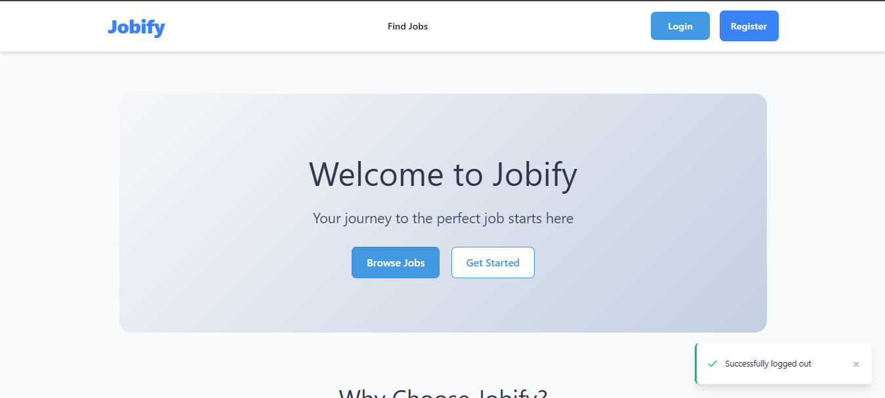

# 🚀 Jobify 

a full-stack job networking and recruitment platform inspired by LinkedIn and Wuzzuf. It helps job seekers connect with employers, apply, and build professional profiles. Employers can post jobs, manage applications, and search for talent using intelligent filters.

## 📸 Demo



## 🌐 Live Site

[Live Demo](https://your-deployed-site.com)

## 📦 Features

- ✅ Simplicity in UI
- ✅ recuiter can make post easily
- ✅ job seeker can also find a job easily

## 🛠️ Tech Stack

**Frontend:** HTML, CSS, JavaScript, React  
**Backend:** Node.js, Express.js, MongoDB  

## 🧰 Installation

Clone the repo:

```bash
git clone https://github.com/mohand-amged/jobify-v1.git
cd jobify-v1
